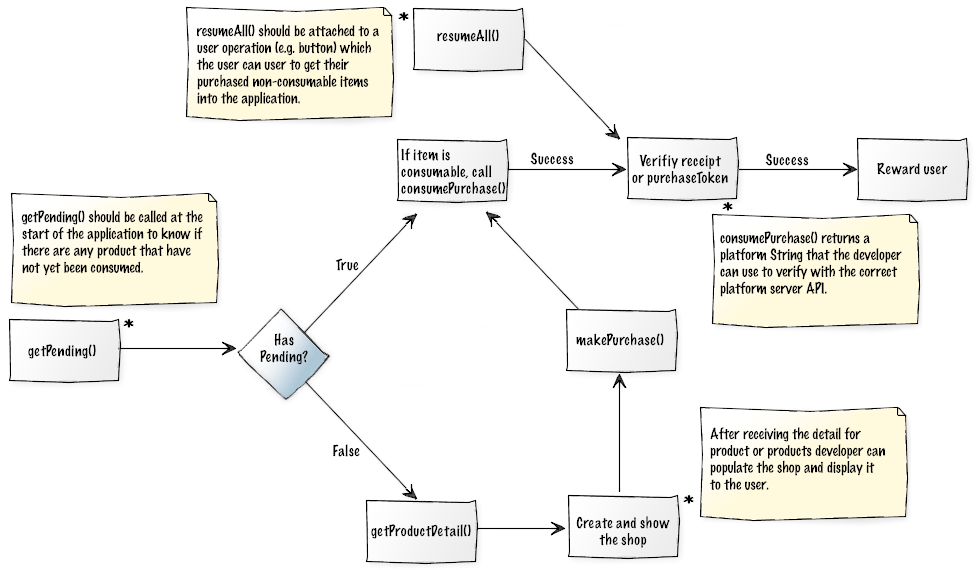

phonegap-plugin-wizPurchase
===========================

A cross-platform mobile application payment API for iOS IAP and Android Billing. 

- PhoneGap Version : 3.3

** NOTE: Not currently supporting subscriptions **

***A lot of work from the Android side of this plugin must be credited to @[poiuytrez](https://github.com/poiuytrez)'s [AndroidInAppBilling](https://github.com/poiuytrez/AndroidInAppBilling/) plugin. We re-used some plugin class code and all the utility classes, but replaced a lot of the API to be usable in a cross-platform manner with iOS. Many thanks goes to him for his hard work.***

## Install

### via CLI

	cordova plugin add https://github.com/Wizcorp/phonegap-plugin-wizPurchase --variable BILLING_KEY="YOUR_BILLING_KEY"

### via config.xml

	<plugin name="jp.wizcorp.phonegap.plugin.wizPurchase" spec="https://github.com/Wizcorp/phonegap-plugin-wizPurchase">
	    <variable name="BILLING_KEY" value="YOUR_BILLING_KEY" />
	</plugin>

You need to specify your billing key **only** if you need Android support.

## Setup

#### iOS

- In iTunes Connect create: your application, any items and an IAP test user (on the main screen see "Manage Users"). 

- Test on a real device (not simulator).

- Log out of any existing Apple iTunes accounts on the device before testing.

- Make sure your application has a version number (do not leave it blank).

#### Android

- Set `debuggable` to `false` and upload a signed version of you application to the Google Play Developer Console.

- Add items to the Google Play Developer Console.

- Upload your apk to Alpha or Beta environment.

- Add your list of test users (Google Group), in the same screen you should see a link ** *1 **

- ** *1 download the application from the link above [important!] **

- Be sure you are logged in to a Google Developer Account on your device.

- Be sure to use a real device (not emulator).


## Purchase Flow



## JavaScript APIs

### getPending(Function success, Function failure)

This method for iOS fetches any pending verification products (which have not been consumed yet).

This method for Android fetches any pending consumption products.

- *Return* success with an Array of one or more Objects containing product information that can be used when consuming or verification.
	e.g.

		[
			{
				platform: "ios" or "android",
				orderId: transaction identifier for iOS or order id for Android,
				receipt: purchaseToken or ios receipt as String,
				productId: "sword001",
				packageName: "jp.wizcorp.game"
			},
			{
				...
			} ...
		]

- *Return* failure with error 

### restoreAll(Function success, Function failure)

Get a list of non-consumable item receipts / purchaseTokens 
								
iOS should internally... 
Check the call the code below return any owned non consumables etc.
				
`[[SKPaymentQueue defaultQueue] addTransactionObserver:self];`
`[[SKPaymentQueue defaultQueue] restoreCompletedTransactions];`		
then `(void)paymentQueueRestoreCompletedTransactionsFinished`

Android should internally call `Bundle getPurchases()` on IInAppBillingService.aidl Class
This populates an Inventory object with all purchases ever made except the consumed purchases.
					
- *Return* success with an Array of one or many puchaseTokens (Android) or receipts (iOS)
	* e.g. Android
		`[ "puchase-token-string", ... ]` 
		
- *Return* failure with error 

(Developer should check any returned items with server APIs. If any items exist that are consumables, but have not been comsumed. The developer should call `consumePurchase()` because it is likely a previous purchase was not completed )
					

### makePurchase(String productId, Function success, Function failure)

Make a purchase given a product Id (Quantity is not settable with the API, it is always 1 to be cross platform complete).
					
(ANDROID: A NON-CONSUMABLE CANNOT BE PURCHASED IF IT IS ALREADY OWNED [not-consumed], this applies to any product Id that has not been comsumed with `consumePurchse()`).
					
iOS should internally call `[SKMutablePayment paymentWithProductIdentifier:productId];`
then add the payment to the payment queue `[[SKPaymentQueue defaultQueue] addPayment:payment]`
When a transaction is complete the receipt is stored in the DB.
					
Android internally should call void `launchPurchaseFlow()` on IInAppBillingService.aidl Class
Upon a successful purchase, the user’s purchase data is cached locally by Google Play’s In-app Billing service.

** See security notes below **

- *Return* success with transaction information

		{
			platform: "ios" or "android",
			orderId: transaction identifier for iOS or order id for Android,
			receipt: purchaseToken or ios receipt as String,
			productId: "sword001",
			packageName: "jp.wizcorp.game"
		}
	
- *Return* failure with error

On success do a receipt verification (if server API exists) gift the user.

|  Android Verification API |
| --------- |:--------:| ------:|
|  URIs relative to *https://www.googleapis.com/androidpublisher/v1.1/applications*, unless otherwise note |
| **GET**  |
| / **[packageName]**/inapp/**[productId]**/purchases/**[token]** |
| Checks the purchase and consumption status of an inapp item. |
	

|  iOS Verification API |
| --------- |:--------:| ------:|
|  Base64 encode the receipt and create a JSON object as follows: `{ "receipt-data" : "receipt bytes here" }`  
| **POST**  |
| https://buy.itunes.apple.com/verifyReceipt |
| JSON is returned. If the value of the `status` key is 0, this is a valid receipt. |

NOTE: Always verify your receipt for auto-renewable subscriptions first with the production URL; proceed to verify with the sandbox URL if you receive a 21007 status code. Following this approach ensures that you do not have to switch between URLs while your application is being tested or reviewed in the sandbox or is live in the App Store.
			
### consumePurchase(String or Array of productIds, Function success, Function failure)

Consume the product for the purchaseId given.
										
iOS removes the item from it's local data store.
					
Android internally calls `int consumePurchase()` on IInAppBillingService.aidl Class
		
Upon a successful purchase, the user’s purchase data is cached locally by Google Play’s In-app Billing service.

** See security notes below **

- *Return* success
- *Return* failure with error 
					

### getProductDetail(String productId or Array of productIds, Function success, Function failure)

Get the details for a single productId or for an Array of productIds.
					
iOS should internally call `[[SKProductsRequest alloc] initWithProductIdentifiers:productIdentifiers]`

Android should internally call `queryInventoryAsync()` on the helper class which should call `getSkuDetails()`.
					
- Return success with Object containing country, currency code and key/value map of products

NB: Currently on Android the country code can not be guessed and as such, it is not returned.

```json
{
	"country": "GB",
	"currency": "GBP",
	"products": {
		"sword001": {
			"productId": "sword001",
			"name": "Sword of Truths",
			"description": "Very pointy sword. Sword knows if you are lying, so don't lie.",
			"price": "Formatted price of the item, including its currency sign.",
			"priceMicros": "Price in micro-units as an unformatted string, where 1,000,000 micro-units equal one unit of the currency."
		},
		"shield001": {
			"productId": "shield001",
			"name": "Shield of Peanuts",
			"description": "A shield made entirely of peanuts.",
			"price": "Formatted price of the item, including its currency sign.",
			"priceMicros": "Price in micro-units as an unformatted string, where 1,000,000 micro-units equal one unit of the currency."
		}
	}
}
```

or empty `{ }` if productIds was an empty array.

- *Return* failure with error as the only argument

#### Security notes (Android)

*** You (the developer) should verify that the orderId is a unique value that you have not previously processed, and the developerPayload string matches the token that you sent previously with the purchase request. As a further security precaution, you should perform the verification on your own secure server. ***
	
### Error Handling

Failure callbacks return an error as String. See the following error table:

|Error String|Description|
|:----------:|---------|
|cannotPurchase		|Purchasing is not possible for the following reasons; <br /> - purchase is being made on a simulator or emulator, <br /> - the device has been identified as rooted. |
|invalidClient		| Indicates that the client is not allowed to perform the attempted action. |
|userCancelled		| Indicates that the user cancelled a payment request. |
|invalidPayment		| Indicates that one of the payment parameters was not recognized.|
|unauthorized		| Indicates that the user is not allowed to authorise payments (e.g. parental lock).|
|unknownProductId	| Indicates that the requested product is not available or could not be found in the store. |
|alreadyOwned		| [Android only] This item has already been bought. It cannot be bought again without consuming it first. |

======
Ref Links
======

### iOS

[http://docs.xamarin.com/guides/ios/application_fundamentals/in-app_purchasing/part_4_-_purchasing_non-consumable_products/](http://docs.xamarin.com/guides/ios/application_fundamentals/in-app_purchasing/part_4_-_purchasing_non-consumable_products/)

[https://github.com/Wizcorp/phonegap-plugin-inAppPurchaseManager/blob/v3.0/platforms/ios/HelloCordova/Plugins/InAppPurchaseManager/InAppPurchaseManager.m](https://github.com/Wizcorp/phonegap-plugin-inAppPurchaseManager/blob/v3.0/platforms/ios/HelloCordova/Plugins/InAppPurchaseManager/InAppPurchaseManager.m)

[http://stackoverflow.com/a/17734756/2206385](http://stackoverflow.com/a/17734756/2206385)

### Android

[http://developer.android.com/google/play/billing/api.html](http://developer.android.com/google/play/billing/api.html)

[http://developer.android.com/training/in-app-billing/purchase-iab-products.html](http://developer.android.com/training/in-app-billing/purchase-iab-products.html)

[https://github.com/poiuytrez/AndroidInAppBilling/blob/master/v3/src/android/com/smartmobilesoftware/util/IabHelper.java](https://github.com/poiuytrez/AndroidInAppBilling/blob/master/v3/src/android/com/smartmobilesoftware/util/IabHelper.java)

[https://github.com/poiuytrez/AndroidInAppBilling/blob/master/v3/src/android/com/smartmobilesoftware/inappbilling/InAppBillingPlugin.java](https://github.com/poiuytrez/AndroidInAppBilling/blob/master/v3/src/android/com/smartmobilesoftware/inappbilling/InAppBillingPlugin.java)

[https://developers.google.com/android-publisher/v1_1/](https://developers.google.com/android-publisher/v1_1/)
